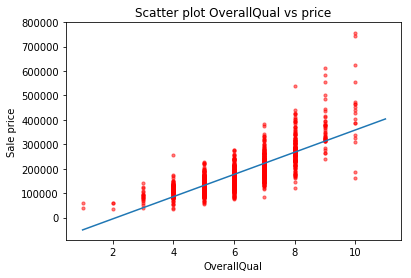
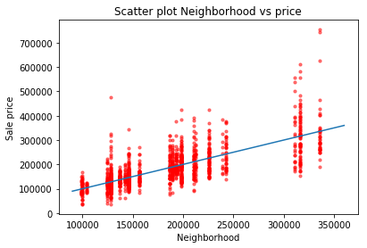
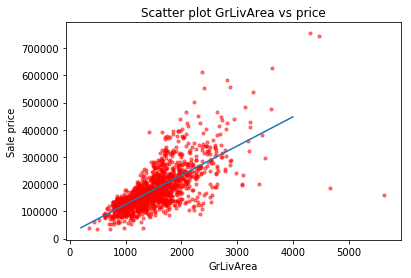

<h1 align="center">House Price Prediction</h1>

This repository contains a simple custom made linear regression model to predict the sales price for each house.

## 🤔 What is this project about?

 The training was based on a kaggle dataset. To predict the sales price for each house. For each Id in the test set, it must predict the value of the SalePrice variable. 
 
 ## 📈 Scatter Plots 

You can run this notebook by downloading it and running it by yourself.
Furthermore you can simply look at the notebook in the jupyter notebook file.

## 🤝 Contributing
If you have a issue or you want to build it better, feel free to contribute to this project by making a simple pull request. :)

## 🤠 Author
Pratik Patel
